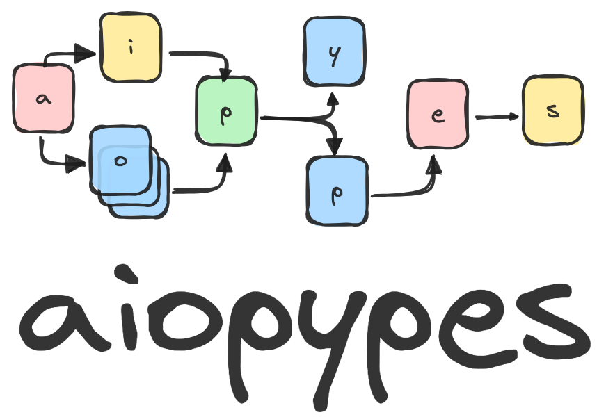
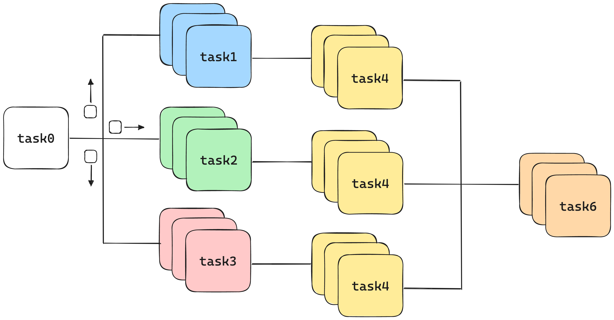

.. aiopypes documentation master file, created by
   sphinx-quickstart on Tue Sep  5 08:17:52 2023.
   You can adapt this file completely to your liking, but it should at least
   contain the root `toctree` directive.

Welcome to aiopypes's documentation!
====================================

What and why
====================================

This package is designed for two main reason: (1) make building asynchronous 
streams *easy* and (2) *maximize throughput* through automatic scaling and routing. 
Built on pure Python -- no dependencies -- this framework can be used for variable, 
decoupled, task-based workloads like web scraping, database management operations, 
and more. Scale this out-of-the-box, with minimal hardware and coding, to process 
10k+/s on production loads.

.. code-block:: python

   pipeline = task0 \
              .map(task1, task2, task3) \
              .map(task4) \
              .reduce(task6)

   pipeline.run()

Currently, this is configured for one machine, one thread using Python's 
asyncio library. Next steps would be to extend this to multithreaded (near-term), 
multiprocessed (less near-term), and even multi-machine (long-term) workloads.

Contents
=================================

.. toctree::
   :maxdepth: 2

   aiopypes
   examples

Indices and tables
==================

* :ref:`genindex`
* :ref:`modindex`
