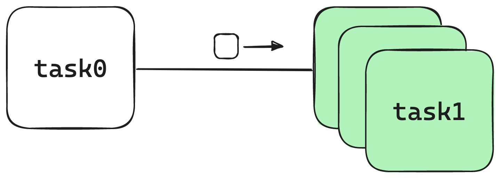

API
=============

.. code-block:: python

   import asyncio
   import pypes

   app = pypes.App()

   @app.task(interval=0.01)
   async def task0():
      return 0.1

   @app.task(scaler=pypes.TanhTaskScaler())
   async def task1(stream):
      async for s in stream:
         yield await asyncio.sleep(s)

   pipeline = task0 \
              .map(task1)

   # task1 will scale up to
   # approximately 10 tasks
   pipeline.run()

app
----------------

.. automodule:: pypes.app
   :members:
   :undoc-members:
   :show-inheritance:

balance
--------------------

.. automodule:: pypes.balance
   :members:
   :undoc-members:
   :show-inheritance:

pipeline
---------------------

.. automodule:: pypes.pipeline
   :members:
   :undoc-members:
   :show-inheritance:

scale
------------------

.. automodule:: pypes.scale
   :members:
   :undoc-members:
   :show-inheritance:

signal
-------------------

.. automodule:: pypes.signal
   :members:
   :undoc-members:
   :show-inheritance:

stream
-------------------

.. automodule:: pypes.stream
   :members:
   :undoc-members:
   :show-inheritance:

task
-----------------

.. automodule:: pypes.task
   :members:
   :undoc-members:
   :show-inheritance:
